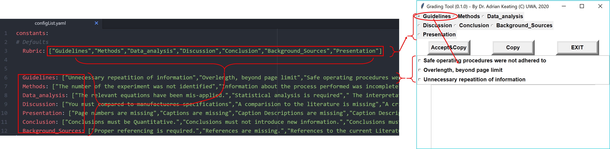
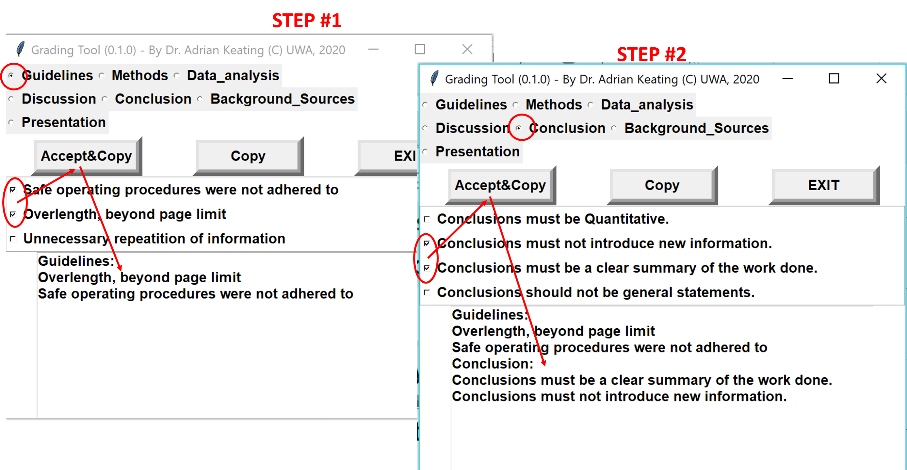

# ReportFeedbackTool
 A multi-selection tool that can assist with the grading of Lab Reports in Engineering/Science based units
## QuickStart
 A build that runs under Windows 10 is provided.  Download and place in the same directory as the [configLsit.yaml](configList.yaml) file.  Edit the config file with:
 1. the Rubrics used for the grading
 2. most frequent feedback and comments relevant to each Rubric

Click the GradingTool.exe to start (a warning may come up because the .exe is not yet certified by Microscoft).  The GradingTool GUI will always stay on the top of the desktop.  You can now review PDF/WORD documents etc.., generating feedback by clicking the relevant check button next to each relevant comment/feedback.  Each time you "Accept & Copy" it will add the comments to the text box and to the clipboard.  You can directly paste into the document to provide comments, or EDIT the text box and then select the "copy" button, which will copy the edited comments.

## Motivation
  
  We need to grade student papers and are being constantly pushed to reduce grading time (as it costs the institution money) while at the same time increasing feedback to the learner.  I developed this tool to assist with both of these requirements.  It allows any [configLsit.yaml](configList.yaml) file ( a human readable type of text file) to be custom designed for each assignment being graded.  The contents of the [configLsit.yaml](configList.yaml) file is shown in Figure 1.  As shown in the Figure, the file starts with a python-like list of strings, that defines the Rubric being used.  The strings should contain NO-SPACES.  Next in the file, for each string in the Rubric List, the string name is defines as another python-like list of strings, this time defining the relevant feedback for each item.  Enter here the most common mistakes that the learners tend to make.  This list can develop over time and I estimate after 2-3 years of use, you would have captured 95% of the mistakes that the learners tend to make when writing the report.
  

   
 
   

 <figcaption > <I><b>Figure 1:</b>Example configList.yaml file defining the Rubric and sentences and the corresponding view in the GradingTool </I> </figcaption>  

  As shown in the Figure, this Rubric list becomes a set of radio buttons at the top when the GradingTool.exe program runs, only ONE (1) of which can be selected at a time.  When a radio button is selected, as shown in Figure 2  Step#1, the relevant list of feedback sentences is shown as a set of check boxes and as many check boxes can be selected as desired based on the feedback to the learner.  When the appropriate boxes are selected under that Rubric heading, Selecting "Accept&Copy" will place the selected Rubric heading and selected sentences into the editable text area AND to the CLIPBOARD.  You can subsequently edit the text in the editable text box at the bottom of the GradingTool Graphical User Interface.  Once edited, select the "Copy" button to copy to the clip board and from there, the comments can be pasted in the document to provide feedback to the learner.  

  

   
 
   

 <figcaption > <I><b>Figure 2:</b>Example panels of the GUI in the GradingTool  after selecting :STEP#1: Guidelines Radio Button and then 2 setences followed by clicking the "Accept&Copy" button and ; STEP#2 Conclusions button and corresponding setences from the checkbutton list</I> </figcaption>  
 
 

## Source
The source code [grading_gui.py](grading_gui.py) was created under python 3.7 and the .exe was build using pyinstaller.  Make sure [configLsit.yaml](configList.yaml) and [grading_gui.py](grading_gui.py)  (if running from python) or GradingTool.exe are in the same directory when run.

##Issues:
  the Rubric cannot contain any spaces - this needs to be fixed
